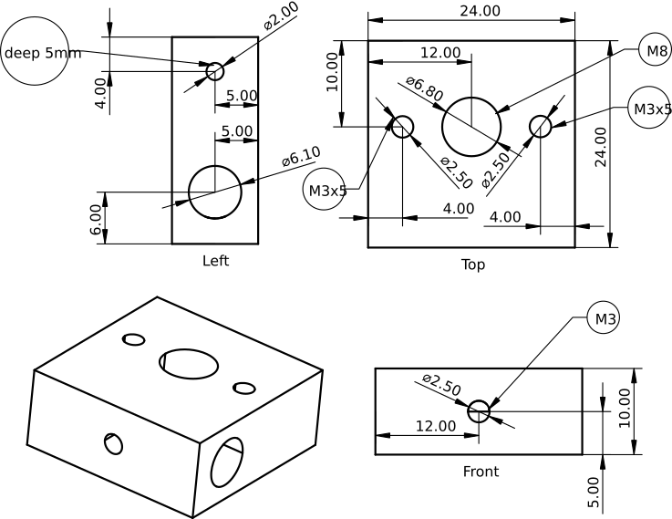
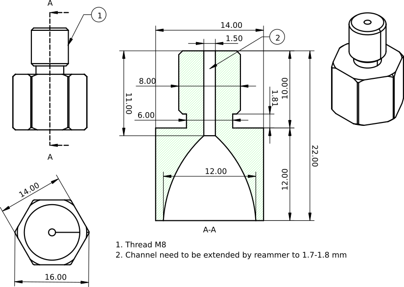

### Описание кострукции фюзера (сопла)

Фюзер состоит из нагревательного блока и сопла.

Нагревательный блок изготовлен из аллюмииниевого бруска размером 24 Х 24 Х 10 мм. Резьба под сопло M8. 
Канал под нагревательный элемент 6.1 мм сквозной. Используется стандартный нагревательный элемент от 3D принтера мощьностью 40 Вт на напряжение 24 В. 
Нагревательный эламент закреплён винтом M3. Канал под термистор 2 мм глубиной 5 мм. Нагревательный блок закреплён на стальном уголке двумя винтами М3.

Сопло изготовлено из 6-и гранной латунной заготовки на токарном станке. Размер между гранями 14 мм длинна 22. 
Конус для подачи ленты сформирован коническим сверлом для кафеля оживальной формы номинальным разменом 12 мм. 
При формировании конуса в начале тонкого канала образуется небольшая "ступенька" которую нужно убрать в процессе полировки.

Хвостовик сверла обрезн до размера ?? мм для уменьшения вибрации при работе. Поверхность конуса отполирована. 

