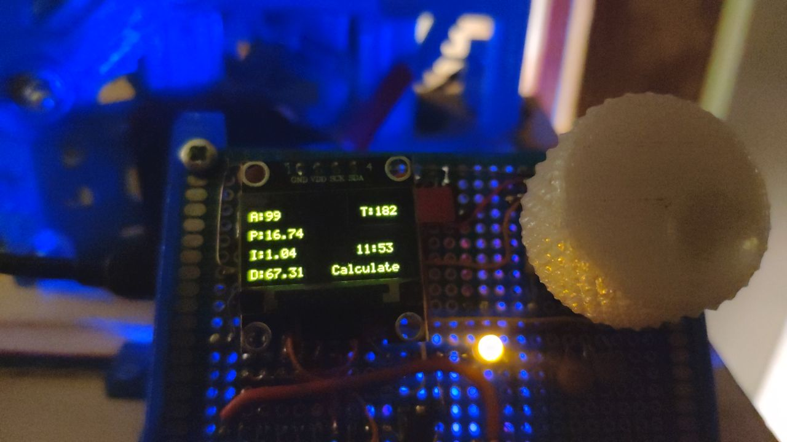

# PID tuner

Подобрать коэффициенты PID регулятора нагревателя можно с помощью этого скетча.
Скетч загружается **вместо** основной прошивки. Время работы скетча не менне 20 минут. Результат работы отображается на экране и в serial console. Коеффициенты P, I и D нужно руками перенести в файл PETCTL_cfg.h

Example:
```
#define CFG_PID_P 12.69
#define CFG_PID_I 0.71
#define CFG_PID_D 57.11
```



Тюнер совсем не идеальный. За несколько раз можно прткинуть какие коэффициенты должны быть. Мой  результат после тюнера: при разогреве "закидывает" на 10° в плюс, потом сбрасывает на 2° а потом держит стабильно. Для реальной работы приемлемо.


