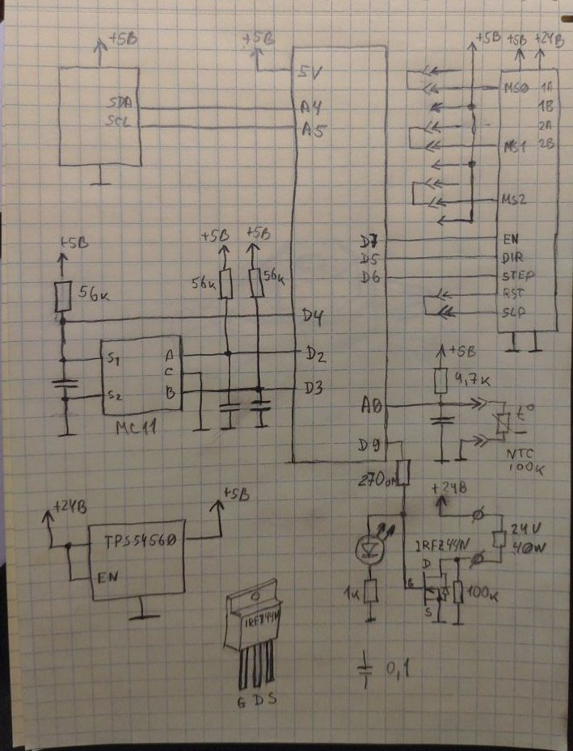
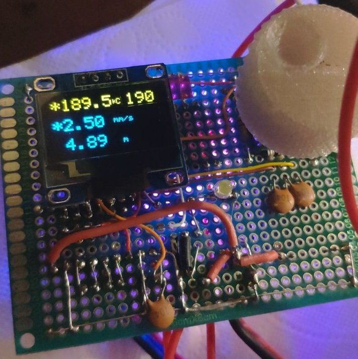

# PETCTL

Это контролер управляющий станком преобразующим ленту нарезанную из PET бутылок в волокно пригодное для 3D печати.
Проект на очень ранней стадии но я его использую и, как правило,  у меня всё работает ;)
Вот схема:

- Всё это управляет [редуктором от Роберта](https://3deshnik.ru/forum/viewtopic.php?f=37&t=986&start=600#p53213), [модификация Анатолия](https://3deshnik.ru/forum/viewtopic.php?f=37&t=986&start=1005#p55008) и [моя шестерёнка на двигателе](https://3deshnik.ru/forum/viewtopic.php?f=37&t=986&start=1470#p57653) (предлагаю назвать его RAM :). Нагревательный блок со стандартными нагревателем от принтера 24V 40W. 
- Питается от принтерного же БП на 24V. Для получения 5V используется модуль TPS54560. Потому что он у меня валялся. Можно использовать что нибудь поскромнее но 7805 на падении 19V, наверное, "спечётся". Наверное, это всё будет работать и от 12V. 
- "Сопло" и нагревательный блок мои. Пока не понятно хорошие или нет.
- Печатной платы нет. Собрано на макетке т.к. пины раз в пару дней меняются. Что то допаивается что то отрезается.
- У меня нет желания, возможности и способностей создавать полноценный, хорошо повторяемый проект и поддерживать его как это [сделал уважаемый Zneipas](https://3deshnik.ru/forum/viewtopic.php?f=37&t=986), за что ему большое спасибо! Но на любые вопросы готов ответить, если будет не лень.
- Начальная схема предложена ɢᴇᴏʀɢɪʏ(@nehilo011)  но от неё уже осталось далеко не всё. Собственно, схема родилась из примеров от библиотек.
- Прошивка (скетч) на 90% состоит из [библиотек AlexGyver отсюда](https://alexgyver.ru/lessons/gyverlibs/) и [отсюда](https://github.com/AlexGyver/GyverLibs).

# Как управлять
Управление получилось очень удобное (для меня):
- один клик регулировка температуры. Подсвечивается целевая температура справа в углу. В этом режиме длинное нажатие включает/выключает нагреватель, загорается/гаснет звёздочка в начале 1-й строки.
- два клика регулировка скорости. Подсвечивается скорость в середине. В этом режиме длинное нажатие включает/выключает двигатель, загорается/гаснет звёздочка в начале 2-й строки.
- Если ничего не нажимать 15 секунд переходит в ждущий режим как на фото.

# Компоненты
- Основной контролер Arduino Nano (я использую вариант [Iskra Nano Pro](https://amperka.ru/product/iskra-nano-pro))
- Драйвер шагового двигателя A4988, DRV8825 или TMC2208 (как поставить перемычки смотреть [тут](https://alexgyver.ru/gyverstepper/))
- OLED дисплей использовал [этот](https://a.aliexpress.com/_AEG46X) или [этот](https://a.aliexpress.com/_9g5hqT) **(Внимание! выводы питания у них ровно наоборот!)**
- Энкодер поставил какой был под рукой. Должен подойти [этот](https://a.aliexpress.com/_9uJ3AL)

